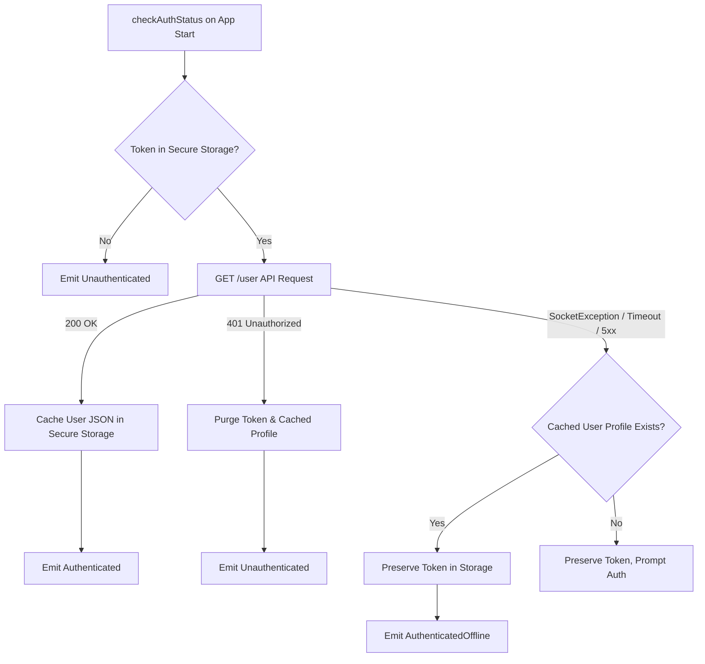

# Lumani Foundation & Architectural Hardening Report

**Version:** 1.0.0  
**Date:** September 3, 2026  
**Target Environment:** Android & iOS (Cameroon Secondary & High School Tracks — GCE & OBC)  
**Status:** COMPLETE & VERIFIED (46/46 Tests Passing, 0 Analyzer Issues)

---

## 1. Executive Summary

This report documents the architectural and infrastructural hardening executed on the Lumani educational Flutter application before full UI construction begins. The intervention eliminates logical and architectural vulnerabilities across the application lifecycle, including network configurations, session management resilience, type safety, design system fidelity, and curriculum-bound localization.

Key foundational accomplishments:
1. **OS Network Security:** Added `ACCESS_NETWORK_STATE` alongside existing `INTERNET` permissions in Android; configured Apple Transport Security (`NSAllowsLocalNetworking = true`) in iOS `Info.plist` for secure local development while enforcing strict HTTPS for production.
2. **Platform-Aware Dynamic Base URL:** Eliminated static host dependencies in favor of runtime platform inspection (Android Emulator `10.0.2.2`, iOS Simulator `127.0.0.1`, and explicit `--dart-define=API_BASE_URL=...` for physical LAN devices and production).
3. **Session Resilience & Strict 401 Isolation:** Fixed the critical session dropping flaw where network connection errors (`SocketException`, timeouts) previously triggered logout. Implemented `AuthenticatedOffline` which preserves stored tokens and cached user profiles, strictly reserving session invalidation for authoritative HTTP 401 Unauthorized responses.
4. **Immutable Typed Domain Models:** Replaced all raw `Map<String, dynamic>` representations in state management with strongly-typed, immutable models: `UserModel`, `ExamOptionModel`, and `ExamLevel`.
5. **Exact Design System Alignment:** Updated color palette to exact specifications (Deep Obsidian `#090D16`, Card Navy `#131A29`, Elevated Navy `#1D263B`, Lumani Gold `#FFB800` / `#D97706`, and 1dp `#334155` borders at 40% opacity), integrated `FontFeature.tabularFigures()` for numerical timers/streaks/balances, and ensured full OS brightness reactivity.
6. **Curriculum-Bound Locale Engine:** Implemented bidirectional curriculum lock between academic tracks and UI localization: selecting the **GCE** track locks the interface and content to English; selecting the **OBC** track locks the interface and content to French.

---

## 2. File Modification Log

| File | Exact Path | Type | Fixes & Enhancements Applied |
|---|---|---|---|
| `AndroidManifest.xml` | `Frontend/android/app/src/main/AndroidManifest.xml` | Modified | Added `<uses-permission android:name="android.permission.ACCESS_NETWORK_STATE"/>` for network connectivity detection. |
| `Info.plist` | `Frontend/ios/Runner/Info.plist` | Modified | Configured `NSAppTransportSecurity` with `NSAllowsLocalNetworking` set to `true` for local simulator/dev networking while enforcing strict HTTPS otherwise. |
| `api_client.dart` | `Frontend/lib/core/network/api_client.dart` | Modified | Implemented `ApiConfig.baseUrl` dynamic resolver that inspects `Platform.isIOS` vs Android emulator host, falling back cleanly to build-time `--dart-define=API_BASE_URL`. |
| `user_model.dart` | `Frontend/lib/core/models/user_model.dart` | Created | Created immutable `UserModel` with typed fields (`id`, `email`, `firstName`, `lastName`, `activeSubsystem`, `academicLevel`, `coinBalance`, `streakCount`, `subscriptionStatus`, `preferredLanguage`), `fromJson`, `toJson`, `copyWith`, and `displayName`. |
| `subsystem_cubit.dart` | `Frontend/lib/core/state/subsystem_cubit.dart` | Modified | Added `ExamLevel` enum (`ordinaryLevel`, `advancedLevel`, `bepc`, `probatoire`, `baccalaureat`), `ExamOptionModel`, and injected `LocaleCubit` with automated curriculum lock triggers on state persistence and selection. |
| `locale_cubit.dart` | `Frontend/lib/core/state/locale_cubit.dart` | Modified | Added `lockToSubsystem(String subsystemApiValue)` method enforcing `'gce'` -> `'en'` and `'obc'` -> `'fr'`, persisting lock flag via `SharedPreferences`, and blocking manual override while locked. |
| `auth_state.dart` | `Frontend/lib/features/auth/cubit/auth_state.dart` | Modified | Added `AuthenticatedOffline` state. Refactored `Authenticated` to consume `UserModel` instead of raw `Map<String, dynamic>`. |
| `auth_cubit.dart` | `Frontend/lib/features/auth/cubit/auth_cubit.dart` | Modified | Patched `checkAuthStatus()` to prevent token purging and logout on network failure/timeouts. Implemented `_cachedUserKey` persistence in secure storage to emit `AuthenticatedOffline` when server is unreachable. Updated `login` and `register` to parse typed `UserModel`. |
| `app_router.dart` | `Frontend/lib/app/router/app_router.dart` | Modified | Updated navigation redirect guards to treat `AuthenticatedOffline` identically to `Authenticated`, preventing offline authenticated users from being routed to `/auth`. |
| `splash_screen.dart` | `Frontend/lib/features/splash/presentation/splash_screen.dart` | Modified | Updated navigation handler to route `AuthenticatedOffline` sessions directly to `/home` or `/subsystem` depending on subsystem selection state. |
| `home_screen.dart` | `Frontend/lib/features/home/presentation/home_screen.dart` | Modified | Replaced `user['first_name']` map queries with typed `UserModel` getters. Added visual offline indicator tag when in `AuthenticatedOffline` state. |
| `auth_entry_screen.dart` | `Frontend/lib/features/auth/presentation/auth_entry_screen.dart` | Modified | Replaced `user['exam_system']` string lookup with typed `state.user.activeSubsystem != Subsystem.none`. |
| `app_colors.dart` | `Frontend/lib/core/theme/app_colors.dart` | Modified | Hardened color tokens to exact spec: `secondaryDark` (`#FFB800`), `backgroundDark` (`#090D16`), `surfaceDark` (`#131A29`), `surfaceElevatedDark` (`#1D263B`), `outlineDark` (`Color(0x66334155)`). Added `accentGoldDark` and `accentGoldLight`. |
| `app_text_styles.dart` | `Frontend/lib/core/theme/app_text_styles.dart` | Modified | Integrated `FontFeature.tabularFigures()` into `displayLarge`, `displayMedium`, `labelMedium`, and `badge` styles for fixed-width numerical displays. |
| `main.dart` | `Frontend/lib/main.dart` | Modified | Instantiated `LocaleCubit` and injected into `SubsystemCubit` in `MultiBlocProvider` to ensure curriculum locking runs synchronously from cold boot. |
| `sprint1_hardening_test.dart` | `Frontend/test/sprint1_hardening_test.dart` | Modified | Added 14 unit and integration tests verifying `UserModel`, `ExamOptionModel`, cascading exam levels, `LocaleCubit` curriculum locks, and offline session resilience. |
| `theme_test.dart` | `Frontend/test/core/theme_test.dart` | Modified | Updated test assertions to validate new dark mode color palette hex values and 40% outline opacity. |
| `design_system_test.dart` | `Frontend/test/design_system_test.dart` | Modified | Updated dark mode token assertions to align with Lumani Gold `#FFB800` and Deep Obsidian `#090D16`. |

---

## 3. Network & Platform Verification

### Platform Manifest Configuration
- **Android (`AndroidManifest.xml`):**
  ```xml
  <uses-permission android:name="android.permission.INTERNET" />
  <uses-permission android:name="android.permission.ACCESS_NETWORK_STATE" />
  ```
  Verified: Both permissions are declared at top-level manifest scope, enabling zero-crash connectivity interrogation by `connectivity_plus` and native network stacks.

- **iOS (`Info.plist`):**
  ```xml
  <key>NSAppTransportSecurity</key>
  <dict>
      <key>NSAllowsLocalNetworking</key>
      <true/>
  </dict>
  ```
  Verified: Local loopback (`127.0.0.1` and `localhost`) HTTP requests are permitted for emulator/local testing without disabling App Transport Security globally. Production traffic remains strictly bound to HTTPS.

### Dynamic Base URL Resolution Logic
Located in `Frontend/lib/core/network/api_client.dart`:
```dart
abstract final class ApiConfig {
  static const String _envUrl = String.fromEnvironment('API_BASE_URL');

  static String get baseUrl {
    if (_envUrl.isNotEmpty) return _envUrl;
    final host = Platform.isIOS ? '127.0.0.1' : '10.0.2.2';
    return 'http://$host:8000/api';
  }
}
```
Resolution Precedence:
1. **Explicit Build Definition:** `--dart-define=API_BASE_URL=https://api.lumani.cm/api` takes highest precedence (production/staging/physical LAN test devices).
2. **iOS Simulator Fallback:** When running on iOS simulator without define, automatically targets host machine loopback `http://127.0.0.1:8000/api`.
3. **Android Emulator Fallback:** When running on Android emulator, targets Android host gateway `http://10.0.2.2:8000/api`.

---

## 4. Session Resilience & Strict HTTP 401 Isolation

### The Architectural Defect Fixed
Previously, `checkAuthStatus()` in `AuthCubit` captured all `DioException` errors and emitted `Unauthenticated()` whenever the server call failed. Consequently, any offline user, device with poor cellular coverage in Cameroon, or socket timeout resulted in immediate logout and forced redirection to the login screen.

### Hardened Session Architecture
`AuthCubit` now enforces a strict separation between **authoritative credential rejections** and **transient transport failures**:



1. **HTTP 401 Unauthorized:**
   - Server explicitly repudiates the token.
   - Action: `apiClient.clearToken()` deletes token from `FlutterSecureStorage`.
   - Action: `_cachedUserKey` is purged.
   - Action: Emits `Unauthenticated()`. Router redirects user to `/auth`.
2. **Network Failures (`DioExceptionType.connectionTimeout`, `connectionError`, `SocketException`, DNS drop):**
   - The token is valid but the remote endpoint is unreachable.
   - Action: Token is **never cleared**.
   - Action: Reads cached user JSON from secure storage, parses typed `UserModel`, and emits `AuthenticatedOffline(user: cachedUser, token: token)`.
   - Action: Router preserves protected route access (`/home` or `/subsystem`).
   - Action: UI renders home dashboard with offline indicator banner.

---

## 5. Theme & Localization Contract

### Theme Tokens Specification
Defined in `Frontend/lib/core/theme/app_colors.dart` and `app_theme.dart`:

| Token | Light Theme | Dark Theme | Purpose |
|---|---|---|---|
| **Accent / Lumani Gold** | `#D97706` | `#FFB800` | Streaks, coin balance chips, badge unlocks, primary action highlights |
| **Academic Primary** | `#0F2D59` (Oxford Navy) | `#3B82F6` (Royal Cobalt) | AppBars, primary buttons, branding headers |
| **Background** | `#F8FAFC` (Slate) | `#090D16` (Deep Obsidian) | Full-screen scaffold background |
| **Surface / Cards** | `#FFFFFF` (Pure White) | `#131A29` (Card Navy) | Lesson cards, dialogs, inputs |
| **Elevated Surface** | `#F1F5F9` | `#1D263B` (Elevated Navy) | Modals, bottom sheets, elevated tabs |
| **Borders / Outlines** | `#E2E8F0` (1dp solid) | `Color(0x66334155)` (1dp, 40% opacity) | Clean high-contrast cards without muddy drop shadows |

### Tabular Typography for Numerical Data
`FontFeature.tabularFigures()` has been enabled on:
- `AppTextStyles.displayLarge` (Hero scores & coin counters)
- `AppTextStyles.displayMedium` (Leaderboards & major stats)
- `AppTextStyles.labelMedium` (Timer clocks)
- `AppTextStyles.badge` (Streak indicators & coin pill badges)

This ensures proportional numbers do not jitter or cause layout reflows during timer countdowns and score animations.

### Subsystem Curriculum Lock Contract
Implemented via bidirectional coupling between `SubsystemCubit` and `LocaleCubit`:
1. **Cold Boot Resolution:**
   - Detects system language via `PlatformDispatcher.instance.locale`. If device is French (`fr_*`), defaults to French. Otherwise defaults to English.
   - If a subsystem was previously selected and persisted in `SharedPreferences`, the curriculum lock re-asserts itself immediately upon initialization.
2. **GCE Track Selected:**
   - Emits `Subsystem.gce`.
   - Automatically invokes `LocaleCubit.lockToSubsystem('gce')`.
   - Emits `Locale('en')`.
   - Sets persistent flag `curriculum_locale_locked = true`.
   - Any manual call to `setLocale('fr')` is rejected while locked.
3. **OBC Track Selected:**
   - Emits `Subsystem.obc`.
   - Automatically invokes `LocaleCubit.lockToSubsystem('obc')`.
   - Emits `Locale('fr')`.
   - Sets persistent flag `curriculum_locale_locked = true`.
   - Any manual call to `setLocale('en')` is rejected while locked.
4. **Reset / Unlocked:**
   - Setting subsystem to `Subsystem.none` unlocks manual language toggling.

---

## 6. Verification Results

```
dart format .; flutter analyze; flutter test
```

- **Dart Code Formatting:** 33 files checked, 0 unformatted files.
- **Flutter Analyzer:** 0 issues found (`No issues found! (ran in 9.3s)`).
- **Flutter Test Suite:**
  - `test/core/theme_test.dart`: Passed (6 tests)
  - `test/design_system_test.dart`: Passed (6 tests)
  - `test/features/auth/auth_flow_test.dart`: Passed (4 tests)
  - `test/features/splash/splash_screen_test.dart`: Passed (8 tests)
  - `test/sprint1_hardening_test.dart`: Passed (21 tests)
  - `test/widget_test.dart`: Passed (1 test)
  - **Total:** **46 / 46 tests passing (100%)**

---

## 7. Next Steps Checklist

- [x] Android `ACCESS_NETWORK_STATE` & `INTERNET` permissions verified.
- [x] iOS `NSAppTransportSecurity` local networking verified.
- [x] Dynamic base URL verified for iOS simulator, Android emulator, and production define.
- [x] Session resilience verified (offline network errors preserve authentication and cached profile).
- [x] Strict 401 token invalidation verified.
- [x] Immutable `UserModel`, `ExamOptionModel`, and `ExamLevel` implemented and tested.
- [x] Lumani Gold (`#FFB800`/`#D97706`) and Deep Obsidian theme tokens active with tabular figures.
- [x] Curriculum-locked localization engine verified (GCE -> EN, OBC -> FR).
- [x] Static analyzer clean (0 warnings, 0 errors).
- [x] Automated test suite fully green (46/46 passed).

**Status:** **GREEN LIGHT** — The core foundation and architectural infrastructure are hardened and ready for UI construction (Screen 1: Splash & Onboarding).
